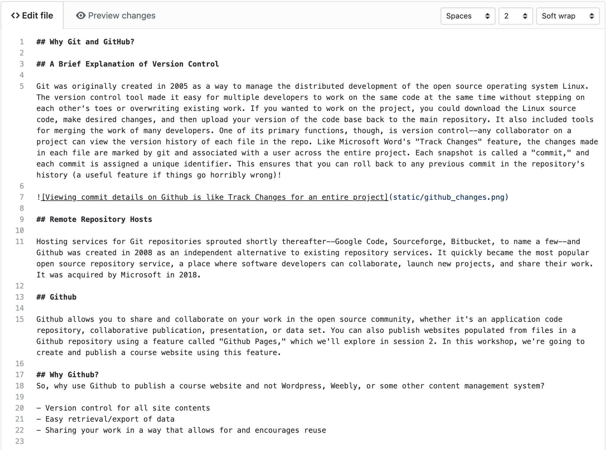

---
layout: page
title: Introducing Markdown
--- 

## Headings and Emphasis

Markdown allows us to format textual features like headings, emphasis, links, and lists in a plain text file using a streamlined set of notations that humans can interpret without much training. Markdown files usually have a .md extension.

In markdown, we insert headings with a single hash mark like this:

    # My Syllabus Heading

A sub-heading (H2) heading uses two hash marks like this:
    
    ## Readings

To provide emphasis, place asterisks around some text:

    *This text will appear italicized.*
    **This text will appear bold.**

For emphasis, you need to mark where it should start and where it should end, so you need asterisks at the beginning and end of whatever text is being emphasized.

## Lists

To create a bulleted list, put a hyphen at the beginning of each list item:

    - Something
    - Another thing
    - One more thing

For a numbered list, use a number followed by a period at the beginning of each list item:

    1. First thing
    2. Second thing
    3. Third thing

## Links

To create a link, put the anchor text (the text you will see) in square brackets and the URL in parentheses. Don't put a space between them:

    I work at [Bryn Mawr College](https://www.brynmawr.edu/).

## Images

An image is similar to a link but begins with an exclamation mark: in square brackets add alternative text describing the image (aka 'alt text'), and in parentheses add the url or path to that image.

```md

```

## Paragraphs

Paragraphs of text are denoted by putting a blank line between them:

    This is a paragraph in markdown. It's separated from the paragraph below with a blank line. If you know HTML, it's kind of like the <p> tag. That means that there is a little space before and after the paragraph when it is rendered.

    This is a second paragraph in markdown, which I'll use to tell you what I like about markdown. I like markdown because it looks pretty good, if minimal, whether you're looking at the rendered or unrendered version. It's like tidy HTML.

## The Github Text Editor

Using these elements -- headings, emphasis, lists, links, images, and paragraphs -- you can build a wide variety of content. 

You can look at an example syllabus in raw text form [here](https://raw.githubusercontent.com/DHRI-Curriculum/git/master/sections/syllabus.md). When it's rendered by GitHub, it looks like [this](https://github.com/DHRI-Curriculum/git/blob/master/sections/syllabus.md).

Your markdown in the Github browser-based editor will look like this:


Note that in the tabbed bar at the top of the editor, there's a "Preview Changes" tab. You can use these tabs to toggle between the editor and the preview. The preview shows you what your markdown will look like when it is rendered by Github:
