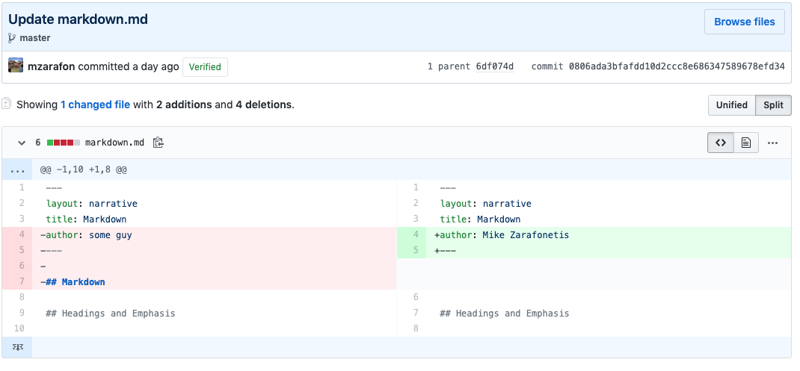

## Why Git and GitHub?

## A Brief Explanation of Version Control

Git was originally created in 2005 as a way to manage the distributed development of the open source operating system Linux. The version control tool made it easy for multiple developers to work on the same code at the same time without stepping on each other's toes or overwriting existing work. If you wanted to work on the project, you could download the Linux source code, make desired changes, and then upload your version of the code base back to the main repository. It also included tools for merging the work of many developers. One of its primary functions, though, is version control--any collaborator on a project can view the version history of each file in the repo. Like Microsoft Word's "Track Changes" feature, the changes made in each file are marked by git and associated with a user across the entire project. Each snapshot is called a "commit," and each commit is assigned a unique identifier. This ensures that you can roll back to any previous commit in the repository's history (a useful feature if things go horribly wrong)!

## Remote Repository Hosts

Hosting services for Git repositories sprouted shortly thereafter--Google Code, Sourceforge, Bitbucket, to name a few--and Github was created in 2008 as an independent alternative to existing repository services. It quickly became the most popular open source repository service, a place where software developers can collaborate, launch new projects, and share their work. It was acquired by Microsoft in 2018.

## Github

Github allows you to share and collaborate on your work in the open source community, whether it's an application code repository, collaborative publication, presentation, or data set. You can also publish websites populated from files in a Github repository using a feature called "Github Pages," which we'll explore in session 2. In this workshop, we're going to create and publish a course website using this feature.

## Why Github? 
So, why use Github to publish a course website and not Wordpress, Weebly, or some other content management system? 

- Version control for all site contents
- Easy retrieval/export of data
- Sharing your work in a way that allows for and encourages reuse
