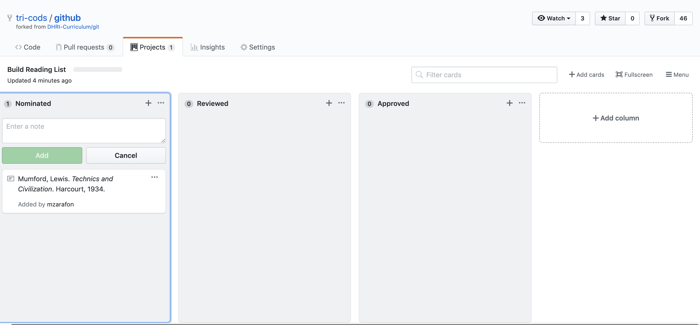

## Other Useful Features

### Projects

Github projects is a useful tool for organizing work around a repository. It uses a "board" and "card" visual interface for creating to-do lists, assigning tasks, and updating team members on progress.

The projects feature also has a few templates to start you off. For example, the "kanban" template creates a "to-do," "in progress," and "complete" column.

