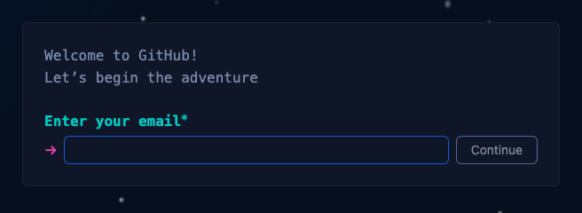
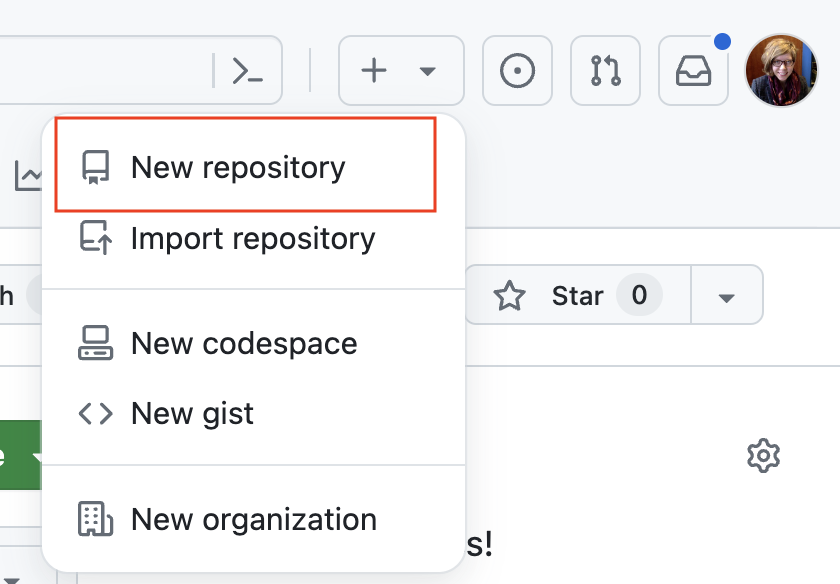
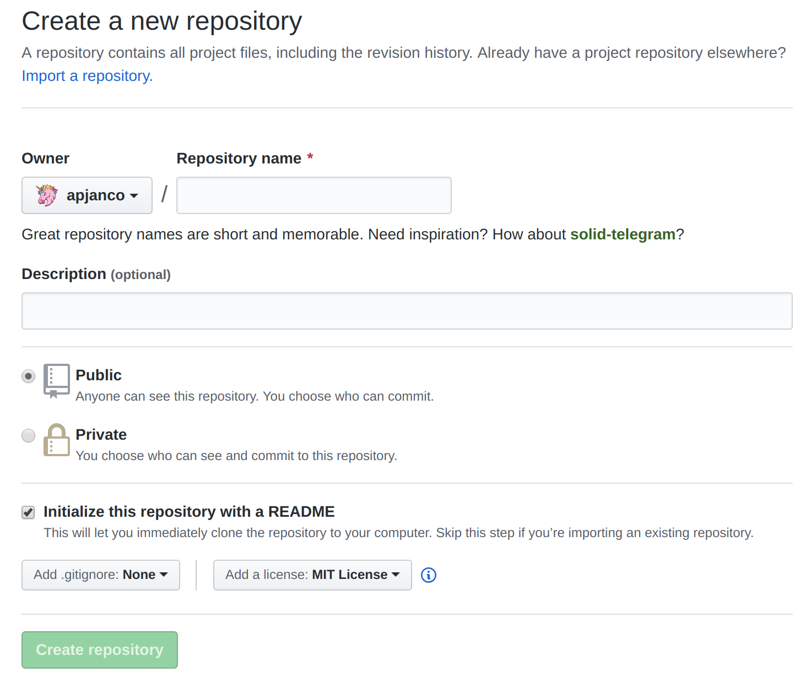
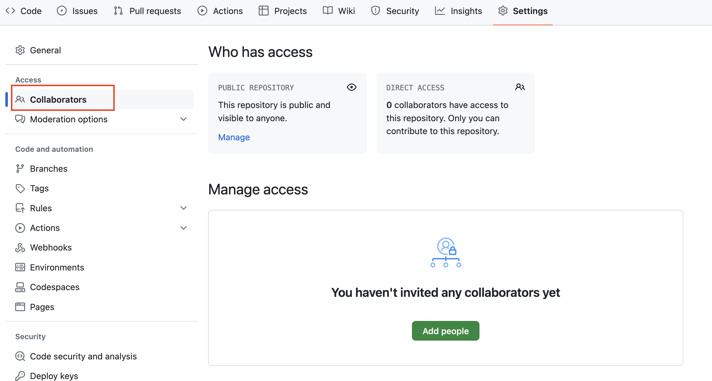
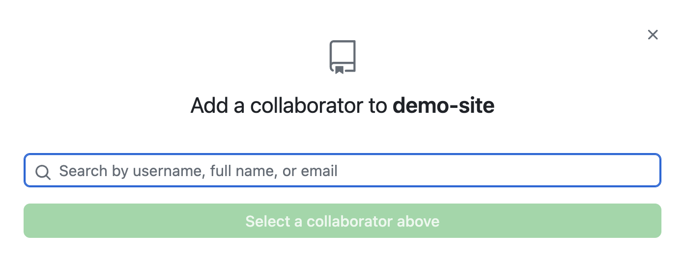
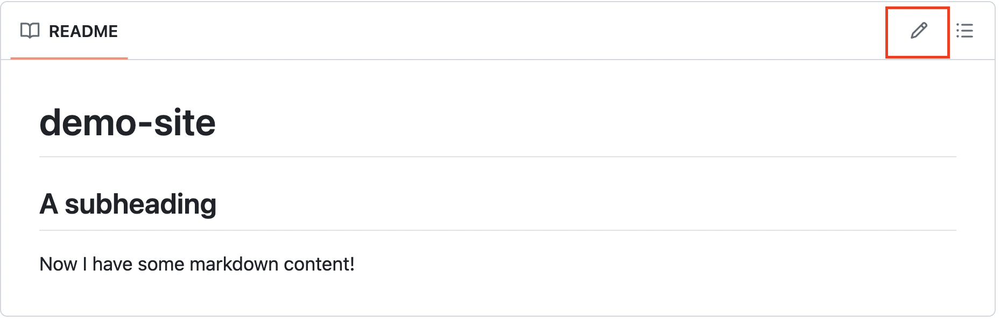
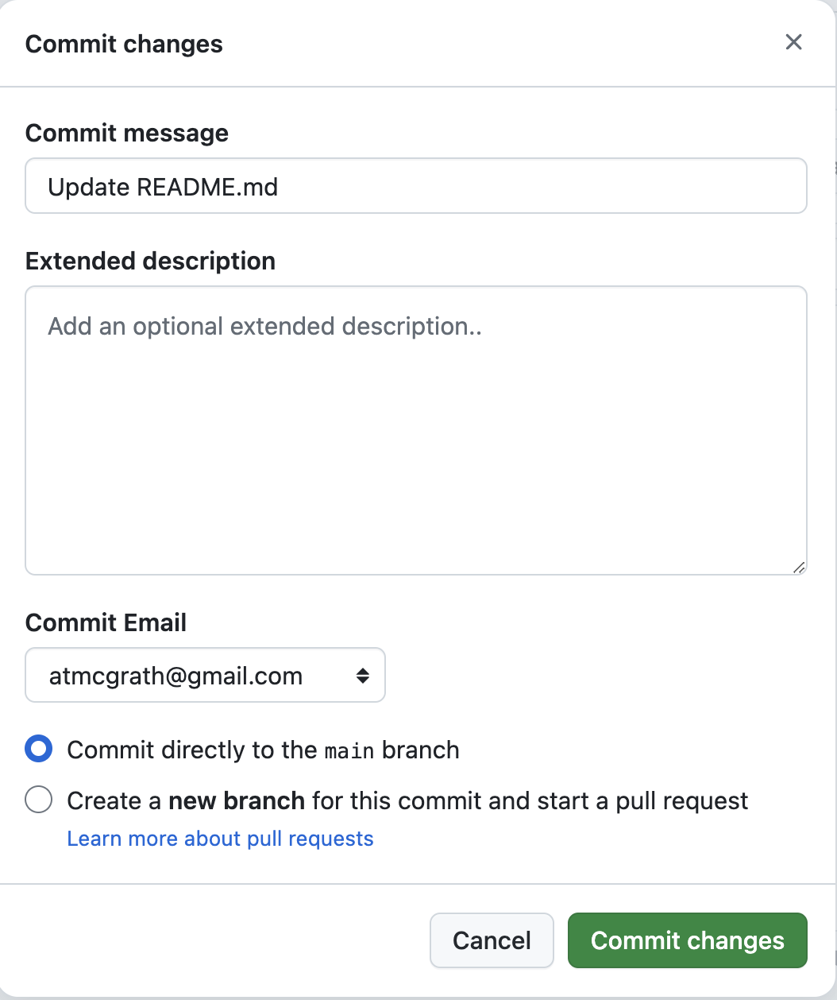

[<<<Back](01-intro.md) | [Next>>>](03-deploy.md)

# What is a repository?

In this section, we'll discuss how to create a GitHub repository for your project in order to store, manage, and publish your work. A repository is a unit of organization (think a directory or folder of files) where all of the materials related to a single project can be stored in the cloud. Every time that you add or edit a file in the repository, Github will keep a record of what changes were made and by whom: Github is designed for collaboration, so you can make changes to a text while someone else is working on the same document. Different versions (branches) of a text can be developed and then merged. You can easily undo changes. You can easily publish your repository as a website using GitHub pages.

In this section, we will:

- Create a Github account
- Create a repository
- Add collaborators and teams
- Begin writing a README file in markdown

## Create a Github account

To begin with:
You will need to have an account with GitHub.  It's free to sign up and to use.  
Go to [Github.com/signup](https://github.com/signup) and enter your information. 

## Create a repository

To create a new repository, log in to Github with the account that you created above and click on the plus button in the upper right corner. Select "New repository":

You should see a form similar to the one below.  

* Enter a name for your repository.  I find it helpful to think of this as the your project's web address or title.  Any spaces in the project name will automatically be filled with at hyphen ("my project" becomes "my-project").

- **Public** vs. **Private**: choose to make the repository visible to anyone or visible only to your collaborators. Because we will be using GitHub Pages to publish websites, choose "public".
* Click on the box to **Initialize this repository with a README**

* It is good practice to add a license for any content. The defaults options when creating a repository are designed for open source software.  They ensure the rights of coders to share and alter each other's code. The option that is most like a traditional copyright for scholarship is Creative Commons Attribution-NonCommercial-NoDerivatives 4.0 International (CC BY-NC-ND 4.0).  This license does not allow the distribution, alteration or commercial use of your content. You can add this license by pasting the following into your README file: ``

## Add collaborators

GitHub is really designed to make collaboration easier and more transparent. To add collaborators to your new repository, navigate to the  "Settings" tab. 

Select "Collaborators" at the top of the left hand menu. You'll be able to see who can view your files and who has direct access to edit your repository.

To add collaborators, select "Add people." You'll be able to add anyone with a GitHub account.

For now, add Roberto (@betovargas) and Alice (@atmcgrath) as collaborators on your site.

## Edit the README.md

Return to the "Code" tab or main page of your repository. If you scroll down, you'll see a list of files and folders within your repository. Currently, your repository is empty except for a file called "README.md". On the same line as the filename, you'll see a message and a timestamp: this indicates the last time this file was edited and the editor's description of their changes.

If you continue scrolling down, you'll notice that the contents of the README.md file also appear on the main page of your repository. You'll probably see the repository name and no other text. The README file is the main documentation page for your project; developers use it to provide context about their project and sometimes instructions for how to use their code. Itt will also be the default content source for your GitHub Pages website, so let's add some text.

Use the pencil icon on the right to edit this file. You'll notice that this looks different from a traditional text editor and that there's no formatting menu: that's because it's a markdown editor (in fact, the file extension .md is a markdown file). If you'd like to format your text using markdown, feel free to check out our [markdown guide](../more/markdown.md)

Below the existing text, type a sentence or two. If you need suggestions, you can always use `Hello World!`

Once you've added some text, you will want to 'save' your changes by using the "Commit changes" button. 

In the "Commit message" field, add a message that describes the change you just made. Then select "Commit changes" so that  your edits will be integrated into the existing file.

[<<<Back](01-intro.md) | [Next>>>](03-deploy.md)