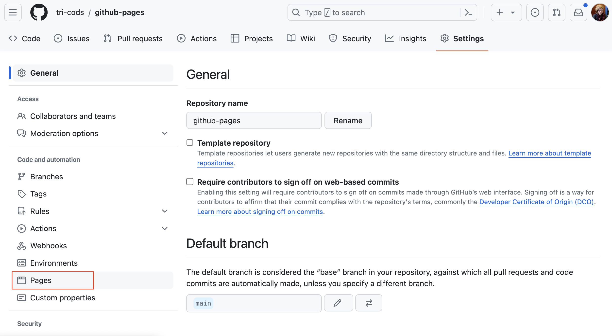
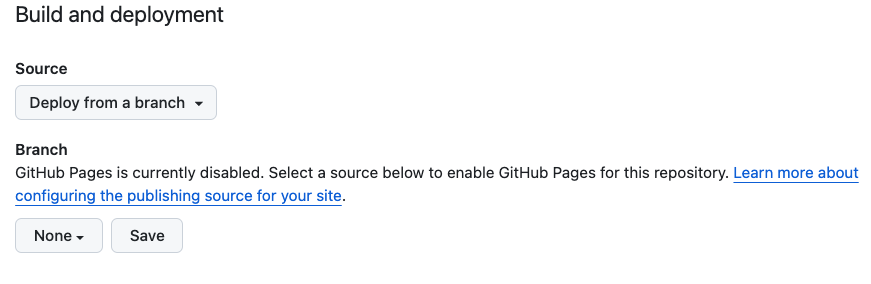
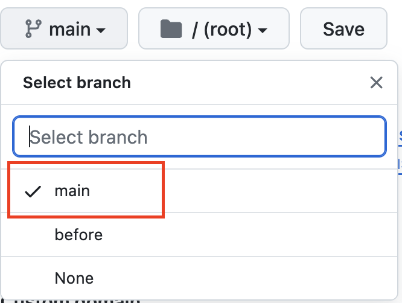

[<<<Back](02-repo.md) | [Next>>>](04-how.md)

# Deploying a GitHub Pages Site

## Activate Pages

Now that you have a GitHub repository, it's now time to share your work with the world.  GitHub pages offers a no-cost coding-optional way to publish your work to the internet.   

1) In your repository, Navigate to the "Settings" tab. 

1) On the left menu, scroll down to "Pages"

3. Under Source, select "Deploy from a branch"

1) Change the `Source` box from `none` to `main branch`. Click "Save"

1) That's it. Your site is ready to deploy! Be patient, because it may take a few minutes to build.

## Add collaborators

- Select "Add Collaborators"

## Your new site's url

- Navigate back to the "Code" tab.
- Edit your "about" details: include a short description
- Under "Website", select "use GitHub Pages URL"
- Save your changes

Now you'll notice that a url has appeared. 

After your 'commit' history, you'll see a yellow dot that indicates your site is in the process of deploying. Once the dot becomes a green check mark, navigate to your URL.

## How it works

While we wait for the site to build, let's take a look at what's going on under the hood.

[<<<Back](02-repo.md) | [Next>>>](04-how.md)