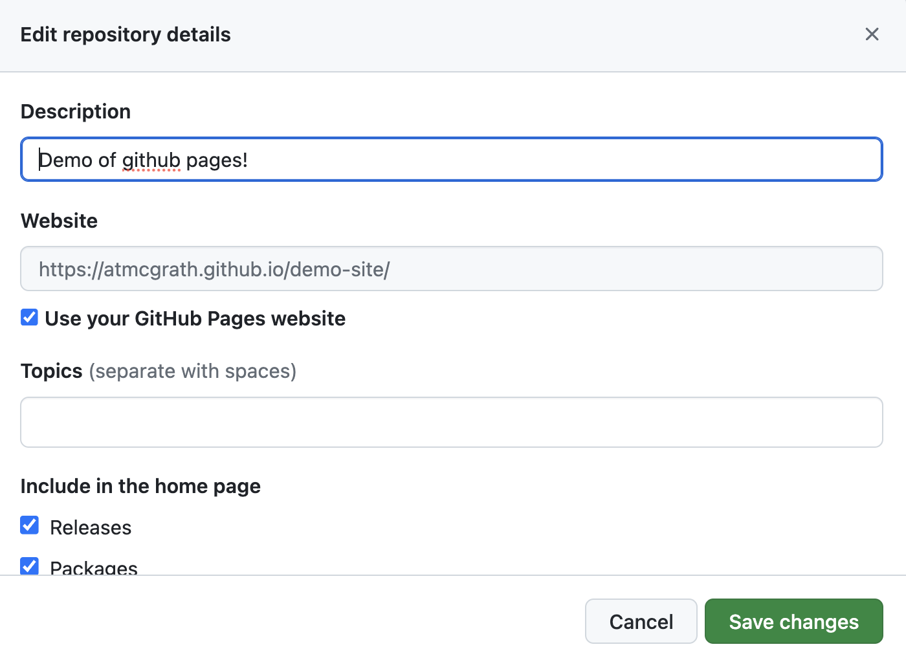

[<<<Back](02-repo.md) | [Next>>>](04-how.md)

# Deploying a GitHub Pages Site

## Activate Pages

Now that you have a GitHub repository, it's now time to share your work with the world.  GitHub pages offers a no-cost coding-optional way to publish your work to the internet.   

1) In your repository, Navigate to the "Settings" tab. 

1) On the left menu, scroll down to "Pages"

3. Under Source, select "Deploy from a branch"

1) Change the `Source` box from `none` to `main branch`. Click "Save"

1) That's it. Your site is ready to deploy! Be patient, because it may take a few minutes to build.

## Your new site's url

The URL to your GitHub Pages site will follow this formula: `username.github.io/repo-name` -- let's make it easier to find.

- Navigate back to the "Code" tab, or main page to your repository. Edit your "About" details by clicking on the gear in the top right corner.

- Write a short description of your repository. 
- Under "Website", check the box to select "use GitHub Pages URL"
- Save your changes

Now you'll notice that a url has appeared.

## Waiting for GitHub Pages

From your main page, you should be able to tell whether GitHub Pages has finished deploying your site.  After your latest 'commit', you'll see a brownish-yellow dot or a green check mark.

The dot indicates that your site is in the process of deploying. Once the dot becomes a green check mark, navigate to your URL and marvel at your new website! 

Sometimes this process takes a few minutes. While we wait for the site to build, let's talk about what it's doing.

[<<<Back](02-repo.md) | [Next>>>](04-how.md)