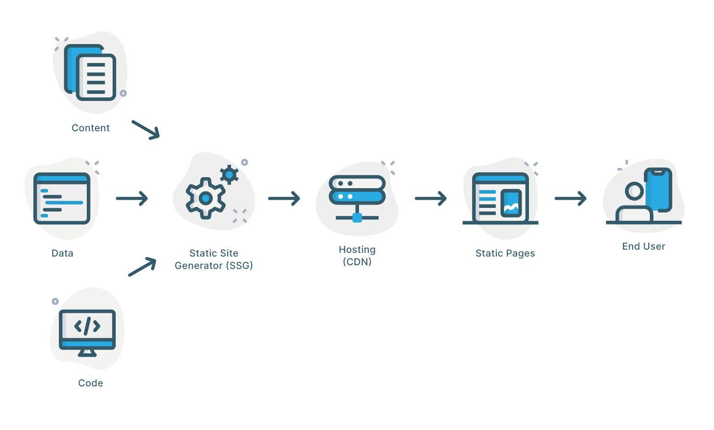
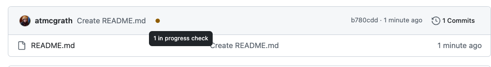

# How it Works

GitHub Pages is a service that takes HTML, CSS and JavaScript files from a repository and builds a site out of them. The image below, created by Kyle Meagher and posted at their vlog titled ["Static Site Generators Explained in 5 minutes"](https://www.cosmicjs.com/blog/static-site-generators-explained-in-5-minutes) is a good representation of the process GitHub Pages uses to build the site



Remember the previous section where you where waiting for the dot to turn green?


 
this is where the cogs (SSG) where turning, taking content, data and code to create a static site hosted by GitHub. 

To understand the significance of this process, let's take a brief look at the history of web design

## A brief history

Part of understanding why we use the tools and standards for web design today involves understanding how web design started, its evolution and why developers have returned to using static sites.

### First website


This site, created on August 23, 1991, was and is a static site. This site is made up of a single HTML file. Any page on a static site is made up of an HTML file. What you see on a static site is the same as what I see on the same static site.

### Dynamic 


The era of dynamic sites brought about sites that generate content "on-the-fly", usually based on user behaivor. Content lives on a database and is updated and displayed as you navigate the site. In other words, in contrast to a static site, what you see is dynamically updated based on the time of day (think of news sites) or user-generated conente (think of social media). 

## Static vs Dynamic

If static sites are made up of single HTML files, what happens when you have to update a feature that appears in each of the files, for example the color of your background? In a dynamic site, this information lives in a database. So, to change the color of your background, just click and pick a color and the change will apply to the whole site


For a static site, it used to be the case that you would have to make this change on each single HTML file. For a site that contains two or three files, this would be no issue but what if a site has 100s of pages like ESPN.com or CNN.com? Static site generators to the rescue! 

## How it works (part 2)

Ok, now that we have some basic understanding of static and dynamic sites, what are the specific tools and languages we will be using during our workshop? 

Answer: HTML, CSS, YAML & MARKDOWN

### Hypertext Markup Language (HTML) or what structures a site

A _markup language_ is a system for organizing and annotating data. Unlike a functional programming language (such as Bash, Python, or C), markup languages don't perform functions or provide instructions -- they simply segment and label different parts of a document, such as headings, paragraphs, lists, images, and links. HTML is the primary language used to structure web-based documents by providing web browsers with information about the _content_ of a document and how it should be displayed, interpreted, or acted upon by functional programming languages. The browser uses this information when displaying the document for users.

**NOTE - Markup vs Markdown:** Markdown and HTML are both types of markup languages; Markdown is a play on words. Markup languages help format content.

```HTML
<!DOCTYPE html>
<html>
<body>

<h1>This is a Title </h1>
<p>This is a paragraph.</p>
<p>This is another paragraph.</p>

</body>
</html>
```

### Cascading Style Sheets (CSS) or what syles a site

CSS (Cascading Style Sheets) is usually used in conjunction with HTML. HTML tells the browser what the different parts of a document _are_. CSS tells the browser how these parts of the document should appear. It is essentially a set of rules that are applied when rendering an HTML document. Its name—Cascading Style Sheets—refers to the fact that there is an order of precedence in how the browser applies CSS rules to a document: more specific rules overwrite less specific rules.

```CSS
  body {
    background-color: blue;
  }
  h1 {
    background–color: purple;
  }
```  

### Markdown

If HTML helps with structure and CSS with style, what does Markdown do? Remember this HTML snipet

```html
<h1>This is a Title </h1>
```
This can also be written in Markdown as

```markdown
# This is a Title 
```
Markdown, like HTML (or XML) is a lightweight markup language that you can use to format plain text documents. Alhtough it is not meant to replace HTML, Markdown syntax is much easier to learn. In addition, Markdown is portable and platform agnostic. In other words, if you take notes using Mardown, you can open those notes in any other application. To add content to your site, you will be using Markdown and letting GitHub Pages convert it to HTML. 

### What is YAML? 

Like Markdown, YAML (which allegedly stands for [YAML Ain't Markup Language](https://yaml.org/)) is designed to be both human-readable and machine readable. in YAML, attributes and values are expressed using a simple colon and a space, for example: 

```YAML
title: Axolotl
description: The story of an adorable aquatic creature
```

The attribute `title` has the value `Axolotl`. 

If you compare this to HTML, you can start to see why languages like YAML and Markdown were developed.

```html
<head>
    <title>Axolotl</title>
    <meta name="description" content="The story of an adorable aquatic creature">
</head>
```


Let's see how we can use GitHub Pages to customize our site without having to edit each single page...

[<<<Back](03-deploy.md) | [Next>>>](05-customize.md)