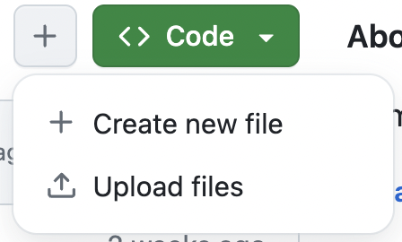
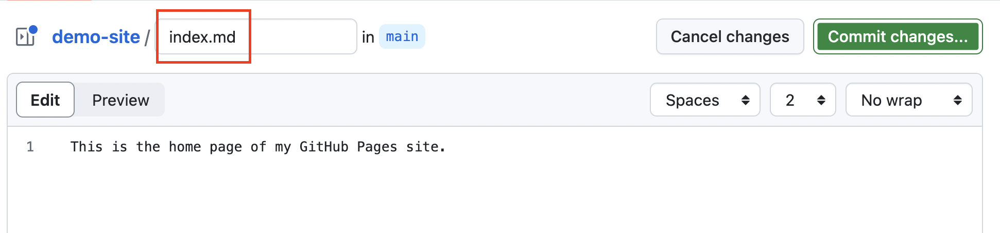

# Adding Content 

In this section we'll explore a few crucial files that you can use to change settings in your GitHub Pages site, and then go over how to add a theme to make your site more attractive. Then, we'll discuss how to add different types of content using markdown.

## Files

### Index

The default main file of a static website is called "index.html". This document is generated for your github pages site as part of the build process. As we've seen, it currently pulls content from README.md to build that page. But what if you wanted to your README for its original purpose -- to document your project -- rather than as your home page? This is why it's good to create an "index.md" file: if you have one, that will automatically be used to build your main page. 

```md
## Welcome to my home page

Here you can find lots of useful information
```

### Config

Another crucial file to add to your site is the `config.yml` file: it's a metadata file written in the YAML markup language. The config.yml file includes crucial settings and metadata for your website, such as title, author, description, theme, and many more options. The `.yml` file extension indicates that the config.yml file is in the [YAML](https://yaml.org/) markup language. Understanding a few of these settings and how to add them can let you do a lot of customization.

An example of settings in `config.yml`

```yaml
title: Axolotl # The top-level website title
description: The story of an adorable aquatic creature # A tagline that usually appears in your site header

remote_theme: pages-themes/cayman@v0.2.0 # Establishes a theme
plugins:
- jekyll-remote-theme
```

### Themes

GitHub Pages sites are highly extensible, meaning that they are infinately customizable, but many customizations require some coding ability. Fortunately, there's a large community of developers creating and sharing open-source themes for Jekyll and GitHub Pages: website templates with layouts, stylesheets, and features that you can use for your site by adding a few lines of YAML to your  `_config.yml` file. There are hundreds of options for Jekyll themes, including several designed specifically for digital scholarship projects:

- [Collection Builder](https://collectionbuilder.github.io/): a minimal digital exhibit builder featuring data visualizations
- [Ed](https://minicomp.github.io/ed/): for digital editions and textual editing
- [Wax](https://minicomp.github.io/wax/): a digital exhibit template

Every theme has different documentation and some take longer to set up than others: for simplicity's sake, we recommend using one of [these themes supported by GitHub Pages](https://pages.github.com/themes/) while you're getting started. 


### Activity: Add an Index and a Config

#### Add an Index.md

- From the main page of your repository, use the `+` button to "Create a new file".



- Be sure to name your file `index.md`!



- Create a header on this page using a hashmark at the beginning of the line: `# Hello, world!` Then, add some additional text to the document. 

- Commit your changes and add a brief message about your edit.

#### Add a Config.yml

- From the main page of your repository, use the `+` button to "Create a new file". 


- Name this new file `_config.yml` -- and don't forget to include the underscore!

- Start by adding a site title and description:

```yaml
title: Your site title
description: A short tagline for your site
```

- Next, add your theme. we'll start with the [Cayman Theme](https://pages-themes.github.io/cayman/), one of the GitHub Pages supported themes. Here's the GitHub repository with documentation for Cayman: https://github.com/pages-themes/cayman

- Copy and paste the following into your config file:

```yaml
remote_theme: pages-themes/cayman@v0.2.0
plugins:
- jekyll-remote-theme
```

- Finally, **commit your changes**: don't forget to add a commit message!

- Be patient as you wait for your site to re-build. 

### What's in a theme?

What exactly does adding a theme do? The `remote_theme` variable in your config file tells GitHub pages where to look for the files that govern the structure and style of your site. Then, it plugs your content (from Markdown and YAML) into the theme's variables, and builds the website. Because these themes are all open source on GitHub, you can see exactly how your theme works by going to the GitHub repository for Cayman: https://github.com/pages-themes/cayman. It may be a little overwhelming at first, but once you get oriented, you can use these files to customize your site even further.

## Content

Your site will look beautiful with the new theme, so why don't we add more content to that main page using Markdown syntax?

### Adding images

To add an image in markdown, we use an exclamation mark `!` followed by square brackets `[ ]` and parentheses. Inside the square brackets, add alternative text to describe the image for accessibility purposes. Inside the parentheses we put the image URL:

```md

```
Important: don't leave a space between the brackets and parentheses.

This is similar to link syntax: `[Bryn Mawr College](http://www.brynmawr.edu)`. This is because when you add an image to a web page, you are really just adding a link to the file location of that image. So, that file location could be hosted on the same folder, or it could be far away.

If you have an image hosted elsewhere, make sure you use the full url, including the file extension at the end. If the image is hosted locally in your github pages site, use the filepath relative to the page where you are linking to it. So, for example, if the image was named `axolotl.jpg` and was in the same folder as the page, you would use:

```

```
Or, if it was in a subfolder called `media`, you would use `media/axolotl.jpg`.

One note about adding media to your site: the size limit for GitHub repositories is one gigabyte of data, so it may not be a good option for hosting lots of media files.

### Adding pages and links

To add another page to your website, simply create a new markdown file in your repository. To link to that page, use the filename without the `.md` as the page "slug" or url ending. For example if I created a new page called `cv.md` in the same folder as `index.md` and wanted to link to it from `index.md`, I would add a link like this:

```md
Check out my [Curriculum Vitae](cv)!
```

If you prefer a single-page scrolling site, you can also include links to different sections of your page. Markdown automatically generates an index for each header you create -- that means you can link to it from elsewhere on the page using a `#` followed by a lowercase version of the header, with spaces replacing hyphens (for example, "Adding Content" would be `#adding-content`).

```
[Contact me](#contact-information)

## Bio

Information about me.

## Projects

## Contact Information

```

### Page metadata

Markdown files and YAML are complementary and frequently occur in the same document, for example, using YAML to provide metadata for a page. Adding a YAML header can be useful if you'd like to give your page a title that's separate from the site title, or if you'd like to specify an author, date, or other attributes. Finally, if you have a more complex theme with a header image or multiple layouts, YAML headers are often used to specify those options for the page.

The YAML header appears at the very top, sectioned off by two sets of hyphens:

```
---
title: CV
layout: default
---

## Curriculum Vitae

```


### Activity: adding content to your site

Build out the content of your site by editing your `index.md`. Use markdown syntax to add headers, images, lists, and links -- refer to our [markdown cheatsheet](../more/markdown.md) or the more comprehensive [Markdown Guide](https://www.markdownguide.org/) as needed.

Need some placeholder text? Check out [Lit Ipsum](https://litipsum.com), a site that generates placeholder text text from a selection of public-domain British novels, as an alternative to the [Lorem Ipsum](https://www.lipsum.com/) passage exemplum from the early days of the printing press.

Add one or two images to your site. These can be linked from elsewhere or uploaded directly to your repository. Make sure that anything you upload to your site does not have rights restrictions: here are some recommendations for adding rights-free media:

- [Wikimedia Commons](https://commons.wikimedia.org/) images: you can link to these directly by clicking "use this file on the web" and copying and pasting the File URL
- [Unsplash.com](https://unsplash.com/) offers free-to-use stock photos by professional photographers. Download an image you like (I recommend using the small resolution size) and give credit to the photographer.
- [Free to Reuse sets from the Library of Congress](https://www.loc.gov/free-to-use/): eclectic media from their collections without rights restrictions.

Create a new page for your site by adding a new markdown file to your repository -- add a YAML header and to indicate the page title as well as links to navigate between your pages or internally on a page.

[<<<Back](04-how.md) | [Next>>>](06-customize.md)