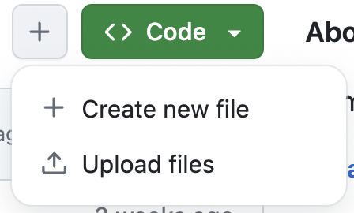
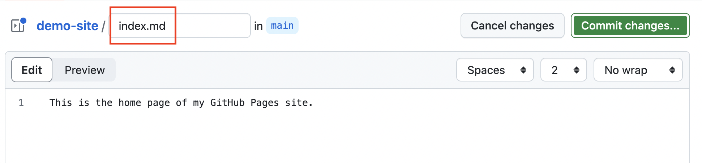

[<<<Back](04-how.md) | [Next>>>](06-resources.md)

# Customizing your GitHub Pages Site

In this section we'll explore a few crucial files that you can use to change settings in your GitHub Pages site, and then go over how to add a theme to make your site more attractive. 

## Index

The default main file of a static website is called "index.html". This document is generated for your github pages site as part of the build process. As we've seen, it currently pulls content from README.md to build that page. But what if you wanted to your README for its original purpose -- to document your project -- rather than as your home page? This is why it's good to create an "index.md" file: if you have one, that will automatically be used to build your main page.

### Activity: add an index.md

From the main page of your repository, use the `+` button to "Create a new file".

Be sure to name your file `index.md`!

Create a header on this page using a hashmark at the beginning of the line: `# Hello, world!` Then, add some additional text to the document. Need some placeholder text? Check out [Lit Ipsum](https://litipsum.com), a site that generates placeholder text text from a selection of public-domain British novels, or use the classic [Lorem Ipsum](https://www.lipsum.com/) passage exemplum from the early days of the printing press.

Commit your changes and add a brief message about your edit.

## Config

Another crucial file to add to your site is the `config.yml` file: it's a metadata file written in the YAML markup language

## Themes

## The GitHub code editor

## Activity: customizing your site

- Add an index.md file and add text and images using Markdown
- Create a _config.yml file and add a theme
- Edit your site title and tagline
- Customize the theme using HTML and CSS

[<<<Back](04-how.md) | [Next>>>](06-resources.md)