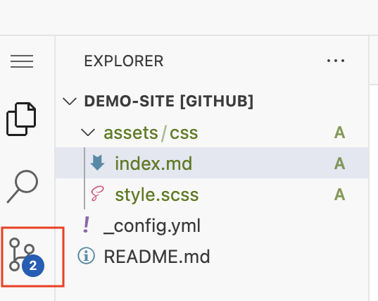
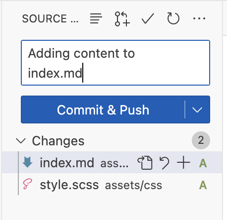

[<<<Back](04-how.md) | [Next>>>](06-resources.md)

# Customizing your GitHub Pages Site


### What's in a theme?

What exactly does adding a theme do? The `remote_theme` variable in your config file tells GitHub pages where to look for the files that govern the structure and style of your site. Then, it plugs your content (from Markdown and YAML) into the theme's variables, and builds the website. Because these themes are all open source on GitHub, you can see exactly how your theme works by going to the GitHub repository for Cayman: https://github.com/pages-themes/cayman. It may be a little overwhelming at first, but once you get oriented, you can use these files to customize your site even further.

### Style

While HTML provides the core structure of most web pages, the style (including color, size, font, shape, and how the look changes on different screen sizes) is governed by another language called **CSS** or Cascading Style Sheets. Jekyll uses a slightly different version of CSS called SCSS. You'll find these files in the `_sass` folder, which has a lot going on. 

Fortunately, Cayman offers simplified instructions for adding your own [Stylesheet](https://github.com/pages-themes/cayman/tree/master?tab=readme-ov-file#stylesheet), so you can customize your color scheme, fonts, layout, and a variety of other features.

### Activity: Adding a custom stylesheet

- From the main page of your repository, use the `+` button to "Create a new file". 
  
- In the title field, type the name `/assets/css/style.scss`

- Add this content to your file -- feel free to copy and paste so the content is identical:

```scss
---
---

@import "{{ site.theme }}";

```

- Below the `@import` line, add some custom CSS. Need inspiration? Start by changing the color of your heading text:

```css

h1 {
    color: pink;
}

h2 {
    color: yellow;
}

```

- Make sure the filename and first 4 lines look like this:


- Commit your changes with a message explaining what you've done.

### Structure

As we discussed in the last section, the version of your website that you see is an HTML file that is built using your content and the Cayman theme's structure and style. We've seen how to add content to your site via the markdown file, as well as how to add an additional stylesheet that will override the stylesheet built into the theme. But what if you want to change something in the HTML itself -- such as the links in the heading? Well, this is when understanding the structure of your theme comes in handy. Let's take a look.

In the Cayman theme, like many other Jekyll themes, most of the HTML is found in the`_layouts` folder. In this case, there's only one layout: `default.html`. This file sets the basic structure of each page in your site. If you've seen HTML before, you might notice that this file looks a little different: that's because it also uses a language called [Liquid](https://shopify.github.io/liquid/). That is how the YAML variables you add to your pages and your config file get plugged in to the layout. 

You'll notice at line 30, that there's a variable called `content`

```html
    <main id="content" class="main-content" role="main">
      {{ content }}
```

This variable represents the body of your markdown file, so everything you add as markdown will go here. On your page, this represents the section between the heading and the footer. 

When GitHub Pages builds your site, it starts by looking at your repository for specific settings, metadata, and content. Then it looks to your theme for anything it doesn't find. So in order to edit the default layout, all you need to do is copy this `default.html` file into your repository in the place where it's expected, and make any changes you want.

### Activity: editing the layout template

- In your Pages repository, use the `+` button to create a new file
- Give the file the name `_layouts/default.html` (this will create a folder in your repository called `_layouts`)
- In a new tab or browser window, navigate to the [default layout file in Cayman](https://github.com/pages-themes/cayman/blob/master/_layouts/default.html)
- Click 'Copy raw file' to copy the full contents of `default.html`


- Return to your Pages repository and paste the contents into the editor window.

- Any changes you make to this file will be reflected on your home page when your site is built. Say I wanted to add my full name and the date to the footer. I can do this by editing line 37, which currently has this:

```html
<span class="site-footer-credits">This page was generated by <a href="https://pages.github.com">GitHub Pages</a>.</span>
```

- I could change it to:

```html
<span class="site-footer-credits">This page was created by Alice using <a href="https://pages.github.com">GitHub Pages (2024)</a>.</span>
```

- Once you've made a change, remember to add a message as you commit your changes.

## The GitHub code editor

Once you get into these advanced customizations, you may feel limited by the in-browser editor, which only lets you edit one file at a time. Fortunately, GitHub has other several other options for editing content, including the **github.dev** editor. This option is helpful because it still works in your browser, so you don't have to download or install any software, but you get an environment that lets you work more flexibly.

To open the github.dev editor, navigate to any file and open the dropdown menu next to the pencil button. Select 'Open with github.dev'.


Once your editor has loaded, you will see a window very similar to the code editor VS Code. On the left sidebar, you'll see all the folders and files in your repository. You can use these to quickly navigate between files. 


Your files will save automatically if you make any changes, but they won't be updated in the repository until you commit them. In this interface, committing looks a little different. 

Once you've made a change to your repository, you'll notice that the git button on the far left sidebar has a notification. This means there are changes that haven't been committed yet.



Click on the git button to review and commit these changes. Describe the changes you made in the 'Message' field and then click "Commit & Push" to update your repository.




## Activity: customizing your site

1. Open your repository in the github.dev editor

4. Experiment with changing your style: edit `style.scss` to change the font or add a background color.

5. Change your site's main title and tagline by editing the `_config.yml` file.

6. Add additional links to your header by editing `default.html` 

[<<<Back](05-content.md) | [Next>>>](07-resources.md)