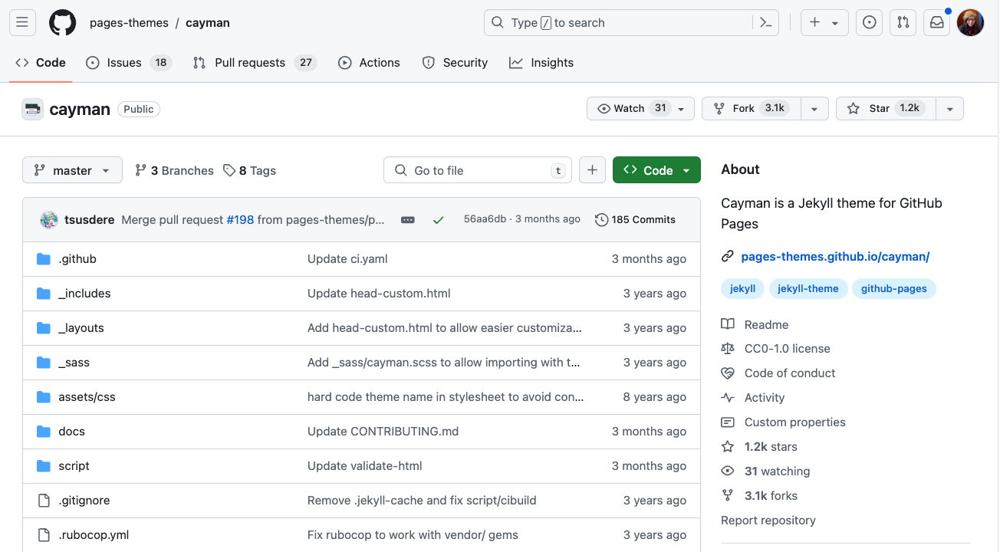

[<<<Back](05-content.md) | [Next>>>](07-resources.md)

# Customizing your GitHub Pages Site

At some point as you build out your site, you may want to add or change something that can't be changed using markdown and YAML: maybe you want to add links to the header as a navigation bar? Or maybe you want to change the way your content aligns, or the size of an image? In this section, we will go over some more advanced customizations you can do within the framework of GitHub pages. We will also talk about the **github.dev editor**, which you may find helpful as you continue your web publishing journey.

## HTML in the mix

As we discussed [in the How it Works Section](04-how.md), Markdown is a simplified form of encoding that uses fewer characters compared to HTML and is easier to write. However, there are many things that HTML can do that markdown can't. Because of this, markdown is built so that HTML elements can be integrated seamlessly as needed. For example, say you want to change the size of an image. That's not possible with markdown, but in HTML you can do this by adding a 'Width' attribute within the image element:

```html

```


Need a refresher or a quick intro to HTML? Check out our [HTML & CSS Workshop](https://github.com/tri-cods/html-css), or look at this [helpful guide from W3 Schools](https://www.w3schools.com/html/).

You can also use HTML to add some styling to elements on your page:

```
<p style="color:magenta;font-family:seriph;border-style:dotted;text-align:center">Axolotl</p>
```


As you can see, this only works on the level of the element, so it isn't very efficient. Next, we'll see how to add your own stylesheet for further customization.

## Adding a Stylesheet

While HTML provides the core structure of most web pages, the style (including color, size, font, shape, and how the look changes on different screen sizes) is governed by another language called **CSS** or Cascading Style Sheets. When I added the style attribute above, I was writing CSS directly into the HTML element, but it usually exists in a separate file called a stylesheet. Creating a custom stylesheet is the best way to control your color scheme, fonts, layouts, and a variety of other features. The easiest way to do this depends on the details of the theme you are using. Fortunately, the theme we are using (Cayman) offers [simplified instructions for adding your own CSS stylesheet](https://github.com/pages-themes/cayman/tree/master?tab=readme-ov-file#stylesheet).

- From the main page of your repository, use the `+` button to "Create a new file". 
  
- In the title field, type the name `/assets/css/style.scss`

- Add this content to your file -- feel free to copy and paste so the content is identical:

```scss
---
---

@import "{{ site.theme }}";

```

- Below the `@import` line, add some custom CSS. Need inspiration? Start by changing the color of your heading text:

```css

h1 {
    color: pink;
}

h2 {
    color: yellow;
}

```

- Make sure the filename and first 4 lines look like this:


- Commit your changes with a message explaining what you've done.

Note: technically Jekyll sites use a combination of CSS, SCSS, and SASS: SCSS and SASS are both stylesheet languages that are extensions of CSS. But for our stylesheets, CSS will work just fine.

## Editing the theme

As we discussed in the last section, the version of your website that you see is an HTML file that is built using your content and the Cayman theme's structure and style. We've seen how to add content to your site via the markdown file, as well as how to add an additional stylesheet that will override the stylesheet built into the theme. But what if you want to change something in the HTML itself -- such as the links in the heading? Well, this is when understanding the structure of your theme comes in handy. Let's take a look at the GitHub repository for the Cayman theme: https://github.com/pages-themes/cayman. 



If you scroll down, you should notice some familiar files, such as `index.md`, `config.yml`, and `README.md`, and even `assets/css/style.scss`. These have the same purpose here as they do in your site. To change any of the theme files, all you need to do is copy them into your own repository and edit them: if GitHub pages finds one in your repository, that file will override the theme file. So if you want to change the homepage layout, you just need to copy that file from the theme and add it to your repository.

### Layouts and Liquid

In the Cayman theme, like many other Jekyll themes, most of the HTML is found in the`_layouts` folder. In this case, there's only one layout: `default.html`. This file sets the basic structure of each page in your site. You might notice that this file looks a little different from regular HTML: for example, take a look at line 2:

```html
<html lang="{{ site.lang | default: "en-US" }}">
``` 
Notice the curly braces and pipes. This is actually using *another* language called [Liquid](https://shopify.github.io/liquid/). In this case, Liquid is used to incorporate specific site-wide and page-wide variables into the HTML template: namely, YAML data you added to the config and page headers. So, if your site is not in English, you can set the language in config file using one of the [ISO 639-1 Language Codes](https://www.w3schools.com/tags/ref_language_codes.asp).

You'll notice at line 30, that there's a variable called `content`

```html
    <main id="content" class="main-content" role="main">
      {{ content }}
```

This variable represents the body of your markdown file, so everything you add as markdown will go here. On your page, this represents the section between the heading and the footer. 

When GitHub Pages builds your site, it starts by looking at your repository for specific settings, metadata, and content. Then it looks to your theme for anything it doesn't find. So in order to edit the default layout, all you need to do is copy this `default.html` file into your repository in the place where it's expected, and make any changes you want.

### Activity: editing the layout template

- In your Pages repository, use the `+` button to create a new file
- Give the file the name `_layouts/default.html` (this will create a folder in your repository called `_layouts`)
- In a new tab or browser window, navigate to the [default layout file in Cayman](https://github.com/pages-themes/cayman/blob/master/_layouts/default.html)
- Click 'Copy raw file' to copy the full contents of `default.html`


- Return to your Pages repository and paste the contents into the editor window.

- Any changes you make to this file will be reflected on your home page when your site is built. Say I wanted to add my full name and the date to the footer. I can do this by editing line 37, which currently has this:

```html
<span class="site-footer-credits">This page was generated by <a href="https://pages.github.com">GitHub Pages</a>.</span>
```

- I could change it to:

```html
<span class="site-footer-credits">This page was created by Alice using <a href="https://pages.github.com">GitHub Pages (2024)</a>.</span>
```

- Be careful editing around brackets and tags and make sure anything that is opened is also closed. Once you've made a change, remember to add a message as you commit your changes.

## The GitHub code editor

Once you get into these advanced customizations, you may feel limited by the in-browser editor, which only lets you edit one file at a time. Fortunately, GitHub has other several other options for editing content, including the **github.dev** editor. This option is helpful because it still works in your browser, so you don't have to download or install any software, but you get an environment that lets you work more flexibly. It also uses syntax highlighting, which can be very helpful as you are working in unfamiliar languages.

To open the github.dev editor, navigate to any file and open the dropdown menu next to the pencil button. Select 'Open with github.dev'.


Once your editor has loaded, you will see an interface that looks very similar to the Desktop application [Visual Studio Code](https://code.visualstudio.com/). On the left sidebar, you'll see all the folders and files in your repository. You can use these to quickly navigate between files. 


Your files will save automatically if you make any changes, but they won't be updated in the repository until you commit them. In this interface, committing looks a little different. 

Once you've made a change to your repository, you'll notice that the git button on the far left sidebar has a notification. This means there are changes that haven't been committed yet.


Click on the git button to review and commit these changes. Describe the changes you made in the 'Message' field and then click "Commit & Push" to update your repository.


## Activity: customizing your site

Now that you know the building blocks of GitHub Pages, we want to give you some time to experiment with more advanced customizations. Try using the github.dev editor to do this.

- Experiment with changing your style: add a custom stylesheet, and play around with CSS variables like colors, fonts, backgrounds, and borders. This [CSS tutorial from W3schools](https://www.w3schools.com/css/default.asp) is a useful reference for getting started.

- Change your site's main title, tagline, and language by editing the `_config.yml` file.

- Add additional links to your header by editing `default.html` 

- Feeling adventurous? You can also create additional layouts by copying and renaming `default.html` and changing the layout variable on your pages.

[<<<Back](05-content.md) | [Next>>>](07-resources.md)
